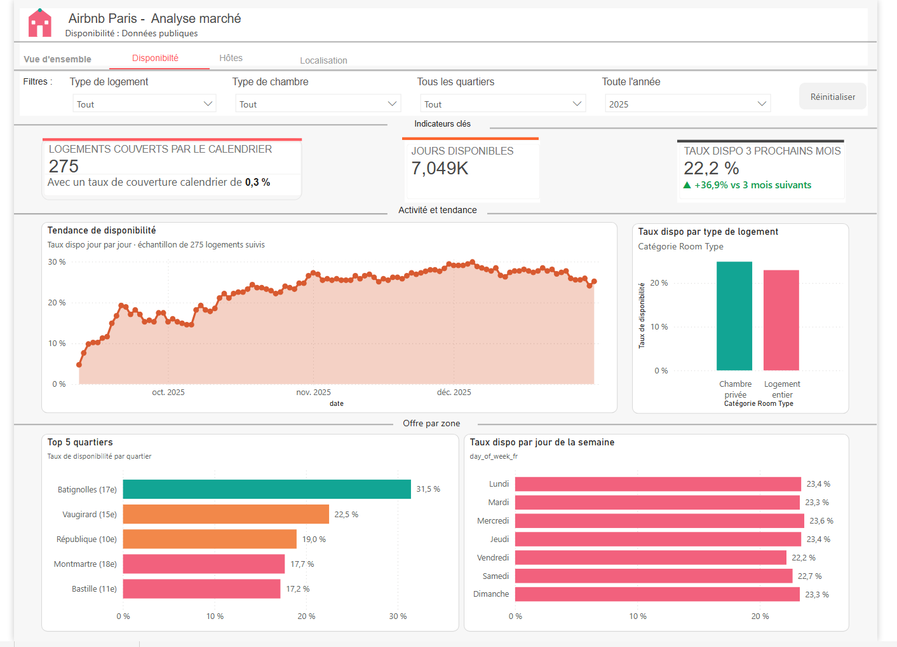
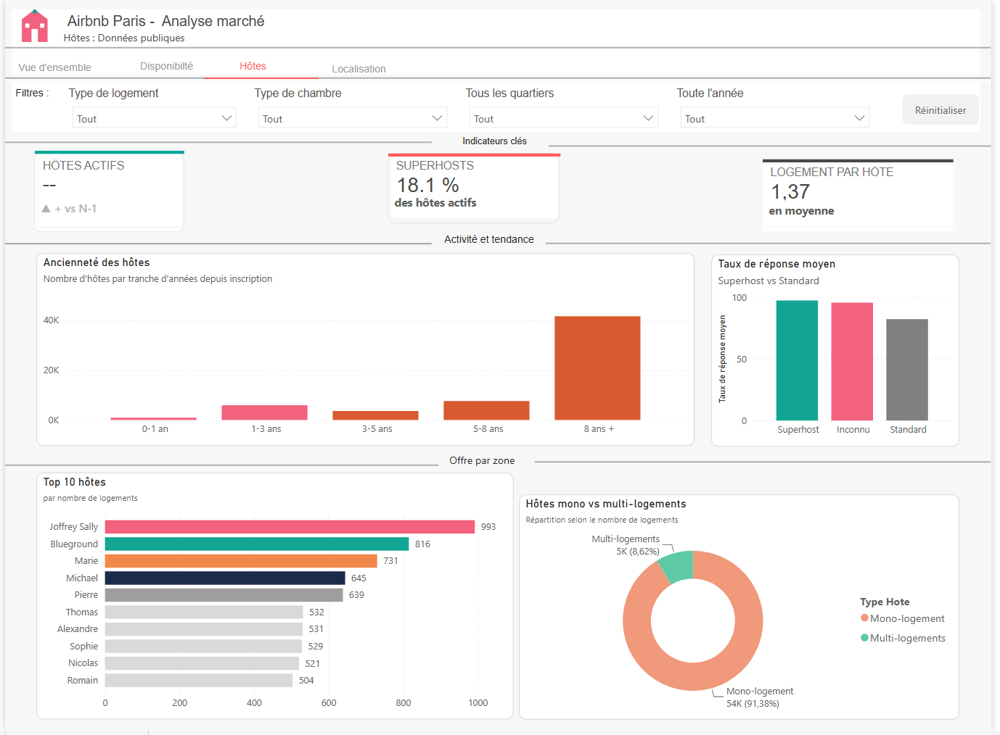
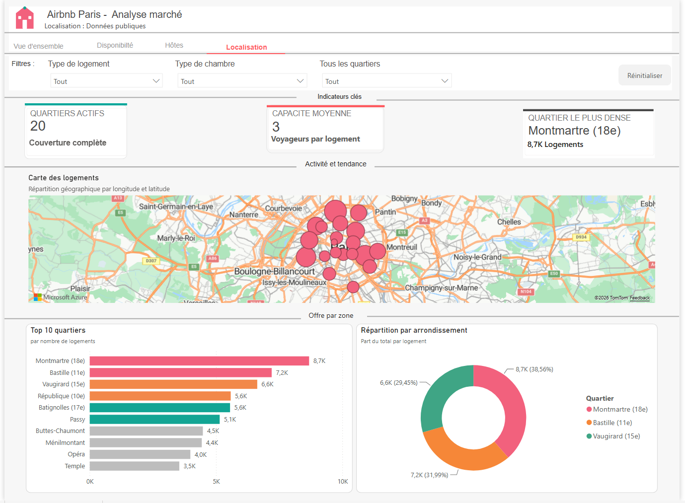

# 🏠 Data Warehouse Airbnb – Pipeline ETL & Tableau de bord Power BI

> Conception d'un **Data Warehouse** à partir de données Airbnb en mettant en œuvre un pipeline **ETL en Python**, une modélisation **en schéma en étoile** et un tableau de bord interactif sous **Power BI**.

---

## 📌 Présentation du projet

Dans le cadre d'un projet de Data Engineering / Business Intelligence, l'objectif était de transformer des données brutes Airbnb en un **entrepôt de données** permettant de produire des indicateurs décisionnels.

Le projet couvre l'ensemble de la chaîne de traitement des données :

- Extraction des données
- Nettoyage et transformation
- Modélisation dimensionnelle
- Chargement dans une base SQLite
- Visualisation dans Power BI

---

## 🎯 Objectifs

- Développer un pipeline ETL en Python
- Construire un Data Warehouse selon un schéma en étoile
- Créer des dimensions et des tables de faits
- Automatiser le chargement dans SQLite
- Concevoir un tableau de bord interactif avec Power BI

---

# 🛠 Technologies utilisées

| Technologie | Utilisation |
|-------------|-------------|
| Python | Pipeline ETL |
| Pandas | Nettoyage et transformation des données |
| SQLite | Base de données |
| Power BI | Visualisation |
| Git | Gestion de versions |
| GitHub | Hébergement du projet |

---

# 📂 Architecture du projet

```
Airbnb-DataWarehouse/

├── Warehouse/
│   ├── airbnb_dw.db
│   ├── dim_property.csv
│   ├── dim_host.csv
│   ├── dim_location.csv
│   ├── dim_date.csv
│   ├── fact_availability.csv
│   └── fact_reviews.csv
│
├── Images/
│
├── src/
│   ├── extract.py
│   ├── transform.py
│   ├── load.py
│   ├── pipeline.py
│   └── utils.py
│
├── README.md
└── .gitignore
```

---

# ⚙️ Pipeline ETL

## 1️⃣ Extraction

Lecture des fichiers sources :

- Listings
- Calendar
- Reviews

---

## 2️⃣ Transformation

Création des dimensions :

- **DIM_PROPERTY**
- **DIM_HOST**
- **DIM_LOCATION**
- **DIM_DATE**

Création des tables de faits :

- **FACT_AVAILABILITY**
- **FACT_REVIEWS**

Traitements réalisés :

- nettoyage des données
- conversion des dates
- suppression des doublons
- création des clés techniques
- modélisation dimensionnelle

---

## 3️⃣ Chargement

Les données transformées sont automatiquement enregistrées :

- en fichiers CSV
- dans une base SQLite

---

# ⭐ Modèle de données

Le Data Warehouse repose sur un **schéma en étoile**.

```
                    DIM_HOST
                       │
                       │
DIM_LOCATION ─ DIM_PROPERTY ─ FACT_AVAILABILITY
                       │
                       │
                  FACT_REVIEWS
                       │
                    DIM_DATE
```

---

# 📊 Tableau de bord Power BI

Le rapport Power BI comporte 4 pages permettant d'analyser :

- 📌 le nombre total de logements et leur évolution
- 🏘️ la répartition des logements par quartier et par type
- 📅 les disponibilités des logements dans le temps
- ⭐ les avis déposés et leur saisonnalité
- 👤 le profil et le comportement des hôtes
- 🗺️ la répartition géographique de l'offre
- 🎛️ des filtres interactifs (quartier, type de logement, type de chambre…)

---

# 📸 Aperçu du tableau de bord

## 1. Vue d'ensemble


**Interprétation des résultats :**

- **Domination des logements entiers** : 88,33 % de l'ensemble des annonces actives à Paris concernent des logements ou appartements entiers (soit 72,3K logements), loin devant les chambres privées (10,66 %) et les chambres d'hôtel (0,81 %).
- **Type de bien principal** : les appartements standards constituent le cœur absolu de l'offre parisienne avec 71K propriétés enregistrées, suivis de loin par les chambres d'hôtes (7K) et les lofts/maisons (1K chacun).
- **Saisonnalité forte de l'activité** : le volume mensuel d'avis clients (2025 vs 2024) met en évidence un pic marqué au mois de juin (près de 60K avis), correspondant à la haute saison touristique parisienne, avant une décrue progressive à l'approche de l'automne.
- **Croissance d'une année sur l'autre** : les indicateurs clés affichent tous une progression par rapport à l'année précédente (logements +19,4 %, hôtes actifs +8,3 %, avis totaux +37,7 %), signe d'un marché en expansion sur la période observée.
- **Top 5 quartiers** : Montmartre (18e) domine avec 8,7K logements, suivi de Bastille (11e) et Vaugirard (15e) — une concentration cohérente avec les zones touristiques centrales de Paris.

---

## 2. Disponibilité



**Interprétation des résultats :**

- **Échantillon suivi** : l'analyse de disponibilité porte sur 275 logements disposant d'un calendrier complet sur la période observée (0,3 % de couverture par rapport à l'ensemble du parc), ce qui permet une lecture fine de la tendance sans viser l'exhaustivité.
- **Tendance de disponibilité croissante** : le taux de disponibilité progresse de 5 % fin septembre à un plateau autour de 25-30 % en décembre — un schéma cohérent avec un calendrier de réservation classique (les dates proches sont déjà réservées, les dates lointaines restent encore libres).
- **Écart par type de logement** : les chambres privées affichent un taux de disponibilité légèrement supérieur aux logements entiers, ces derniers étant davantage prisés par les voyageurs.
- **Disponibilité par quartier inversement corrélée à la popularité** : les quartiers les moins demandés en volume (Batignolles, Vaugirard) affichent les taux de disponibilité les plus élevés (31,5 % et 22,5 %), tandis que les quartiers les plus fréquentés (Montmartre, Bastille) sont aussi les plus tendus (17,7 % et 17,2 %) — signe d'un marché plus compétitif dans les zones à forte attractivité touristique.
- **Effet jour de semaine** : le vendredi est le jour le plus tendu (22,2 % de disponibilité, le plus bas de la semaine), cohérent avec les arrivées de weekend typiques d'un marché touristique urbain.

---

## 3. Hôtes



**Interprétation des résultats :**

- **Profil des hôtes** : 18,1 % des hôtes actifs sont des Superhosts, un label attribué par Airbnb aux hôtes les plus fiables et réactifs.
- **Ancienneté marquée** : la grande majorité des hôtes (plus de 40K) sont inscrits depuis 8 ans ou plus, révélant un marché parisien mature et déjà largement établi plutôt qu'en phase de démarrage.
- **Qualité de service liée au statut** : les Superhosts affichent un taux de réponse moyen nettement supérieur aux hôtes standards, cohérent avec les critères d'attribution du label.
- **Concentration professionnelle** : le Top 10 des hôtes révèle une forte présence de gestionnaires multi-logements — certains hôtes comme "Joffrey Sally" (993 logements) ou "Blueground" (816 logements, société de gestion locative connue) gèrent des portefeuilles considérables, bien loin du profil de l'hôte particulier occasionnel.
- **Structure du marché** : malgré ces quelques gros acteurs, 91,38 % des hôtes ne possèdent qu'un seul logement (mono-logement), et seuls 8,62 % en gèrent plusieurs — la moyenne de 1,37 logement par hôte masque donc une réalité bimodale entre une majorité de particuliers et une minorité de gestionnaires professionnels concentrant un volume disproportionné de l'offre.

---

## 4. Localisation



**Interprétation des résultats :**

- **Couverture géographique complète** : les 20 quartiers (arrondissements) de Paris sont tous représentés dans le jeu de données, avec une capacité moyenne de 3 voyageurs par logement.
- **Concentration centrale** : la carte des logements confirme une forte densité au cœur de Paris, avec une décroissance progressive vers la périphérie — cohérent avec l'attractivité touristique du centre historique.
- **Quartier dominant** : Montmartre (18e) est à la fois le quartier le plus dense (8,7K logements, 38,56 % du Top 3) et l'un des plus fréquentés en avis, confirmant son statut de pôle touristique majeur.
- **Répartition par arrondissement** : parmi les trois premiers quartiers, Montmartre représente à lui seul plus du tiers de l'offre (38,56 %), suivi de Bastille (31,99 %) et Vaugirard (29,45 %) — une répartition relativement équilibrée entre ces trois zones dominantes malgré l'écart avec le reste du classement.

---

# 💼 Compétences mises en œuvre

### Data Engineering

- Développement d'un pipeline ETL
- Nettoyage et transformation des données
- Modélisation dimensionnelle
- Création d'un Data Warehouse
- Gestion des clés techniques

### Analyse de données

- Manipulation de données avec Pandas
- Contrôle qualité
- Structuration des données

### Business Intelligence

- Création d'un tableau de bord Power BI
- Conception de KPI
- Visualisations interactives
- Mesures DAX avancées (comparaisons temporelles, gestion de contextes de filtre complexes)

### Développement

- Python
- Git
- GitHub
- SQLite

---

# ▶️ Exécution du projet

### Cloner le dépôt

```bash
git clone https://github.com/FatoumataMBALLO/Airbnb-DataWarehouse.git
```

### Installer les dépendances

```bash
pip install pandas
```

### Lancer le pipeline

```bash
cd src
python pipeline.py
```

---

# 🚀 Améliorations possibles

- Chargement incrémental des données
- Migration vers PostgreSQL
- Orchestration avec Apache Airflow
- Conteneurisation avec Docker
- Déploiement sur le Cloud

---

# 👩‍💻 À propos

**Fatoumata Ballo**

Passionnée par la Data, je développe des projets autour de l'analyse de données, des pipelines ETL et de la Business Intelligence afin de transformer des données brutes en informations exploitables pour la prise de décision.

## Compétences

- Python
- SQL
- Pandas
- Power BI
- SQLite
- Data Warehouse
- ETL
- Git & GitHub

📧 Email : fatoumatamballozig@gmail.com

💼 LinkedIn : www.linkedin.com/in/fmballo

🌐 GitHub : [*à compléter*](https://github.com/FatoumataMBALLO)